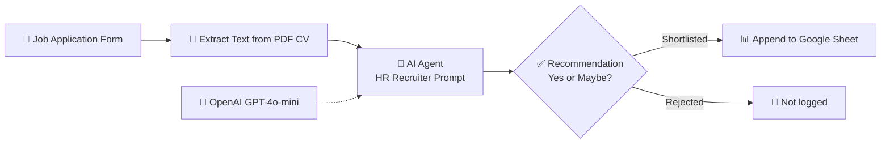

# 🤖 AI-Powered Resume Screening Workflow (n8n)

An automated hiring pipeline built in **n8n** that collects job applications through a web form, reads the uploaded CV, has **GPT-4o-mini** evaluate the candidate like an HR recruiter, and logs shortlisted candidates to **Google Sheets**. No manual CV reading is needed.


## 📌 The Problem

Recruiters spend hours screening CVs, and most applications are a poor fit for the role. This workflow automates the first screening pass: every application is analyzed within seconds, scored consistently against the same criteria, and only promising candidates reach the recruiter's shortlist.

## 🔄 How It Works



| Step | Node | What it does |
|------|------|--------------|
| 1 | **Form Trigger** | Hosted application form: full name, email, position, years of experience, CV upload (PDF) |
| 2 | **Extract from File** | Converts the uploaded PDF CV into plain text |
| 3 | **AI Agent + OpenAI** | GPT-4o-mini analyzes the CV against the applied position and returns a structured evaluation |
| 4 | **If (Shortlist)** | Passes candidates with a `Yes` or `Maybe` hire recommendation |
| 5 | **Google Sheets** | Appends shortlisted candidates with a timestamp and the full AI analysis |

## 🧠 AI Evaluation Output

The agent is prompted to act as an expert HR recruiter and respond in a strict, consistent format, which makes results easy to compare and filter:

```
CANDIDATE: Jane Doe
POSITION: Data Analyst
EXPERIENCE_YEARS: 3
SKILLS_MATCH: High
EDUCATION_LEVEL: BS Computer Science
KEY_STRENGTHS:
  - Strong SQL and Python skills
  - Experience building BI dashboards
RED_FLAGS: None
HIRE_RECOMMENDATION: Yes
SCORE: 84
SUMMARY: Solid technical fit with relevant analytics experience. Recommended for a first-round interview.
```

*(Example output for illustration.)*

The prompt also receives the candidate's **self-reported years of experience**, so the model can flag mismatches between what the applicant claims and what the CV shows.

## 📊 Google Sheet Output

Each shortlisted candidate is logged as a new row:

| Timestamp | Name | Email | Position | Exp Years | Full Analysis |
|-----------|------|-------|----------|-----------|---------------|

## 🚀 Setup

**Prerequisites:** an n8n instance (cloud or self-hosted), an OpenAI API key, and a Google account.

1. **Import the workflow.** In n8n, go to **Workflows → Import from File** and select `resume-screening-workflow.json`.
2. **Add credentials:**
   - **OpenAI:** open the *OpenAI Chat Model* node and add your API key.
   - **Google Sheets:** open the *Append row in sheet* node and connect your Google account via OAuth.
3. **Prepare the sheet.** Create a Google Sheet with these headers in row 1: `Timestamp`, `Name`, `Email`, `Position`, `Exp Years`, `Full Analysis`. Select it in the Google Sheets node.
4. **Activate** the workflow and open the form URL from the *On form submission* node.
5. Submit a test application with a PDF CV and check your sheet.

## 🛠️ Tech Stack

- **n8n:** workflow automation and hosted form
- **OpenAI GPT-4o-mini:** CV analysis via the n8n LangChain AI Agent node
- **Google Sheets API:** candidate database

## ⚠️ Limitations & Future Work

- **Structured columns:** the full analysis is stored as one text cell. A *Structured Output Parser* would split score, skills match and recommendation into separate, sortable columns.
- **Job descriptions:** candidates are judged against the position title only. Feeding in a real job description would make matching much more accurate.
- **Notifications:** email or Slack alerts for high-scoring candidates, and automatic acknowledgement emails to applicants.
- **Rejected candidates:** log them to a separate sheet for auditing, rather than discarding them.
- **Bias & fairness:** LLM screening should support human decisions, not replace them. Recruiters should review AI recommendations before acting on them.
- **File types:** only PDF CVs are supported. DOCX support could be added.

## 👤 Author

**Muhammad Mujtaba Khan Suri** — CS @ UBIT, University of Karachi
[GitHub](https://github.com/MMujtabaX)
